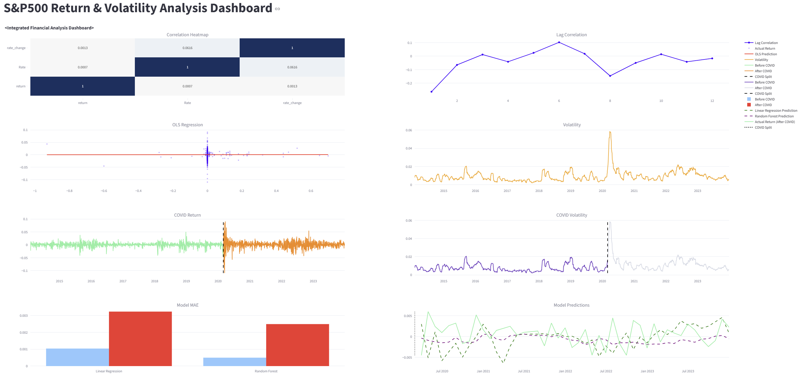

# sp_interest

## 📊 Dashboard Preview



## Analysis of the Impact of Interest Rate Changes on Stock Price Returns and Forecasting Models

This project analyzes how interest rate changes influence stock market returns and builds forecasting models using statistical analysis and machine learning techniques.

---

## Project Overview

The goal of this project is to:

* Analyze relationships between interest rates and stock returns
* Perform statistical modeling (OLS Regression)
* Explore lag correlations
* Build prediction models for market forecasting
* Visualize results through an interactive dashboard

---

## Tech Stack

* Python
* Pandas
* NumPy
* Statsmodels
* Scikit-learn
* Plotly
* Streamlit

---

## Project Structure

```
sp_interest/
│
├── app.py              # Streamlit dashboard application
├── analysis.py         # Statistical & ML analysis
├── data_pipeline.py    # Data preprocessing pipeline
├── requirements.txt    # Python dependencies
└── README.md
```

---

## How to Run

### 1. Install dependencies

```
pip install -r requirements.txt
```

### 2. Run dashboard

```
streamlit run app.py
```

---

## Key Features

* Interest rate vs stock return correlation analysis
* OLS regression modeling
* Machine learning prediction models
* Interactive financial visualization dashboard

---

## Author

**Soomin Kim**
AI Student
Interested in FinTech, Quantitative Finance, and Machine Learning

